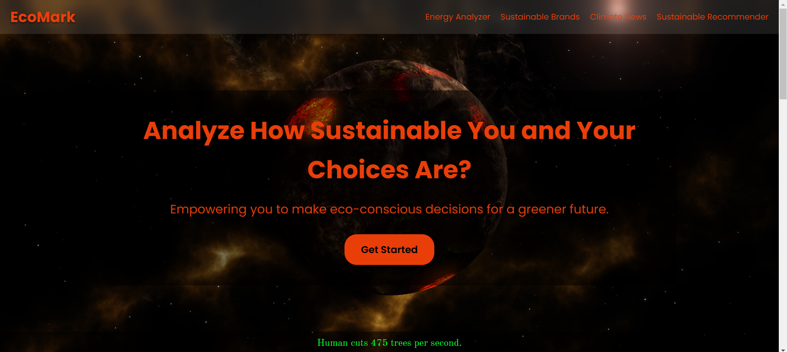
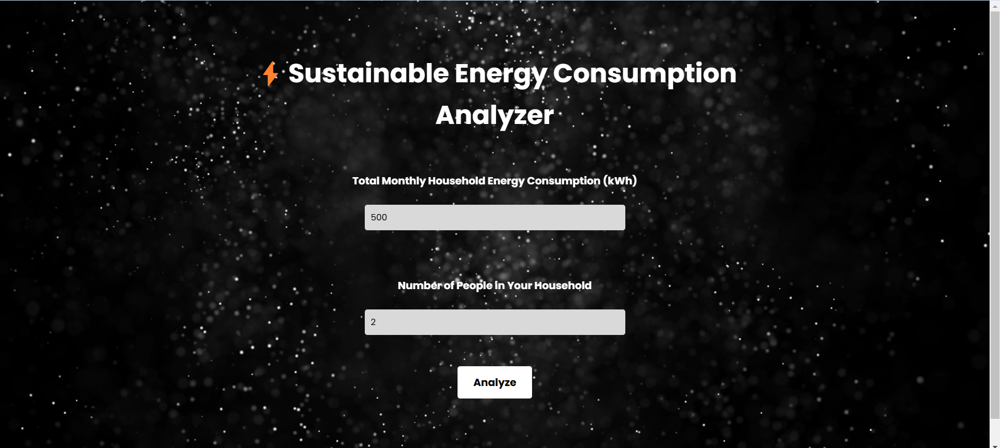
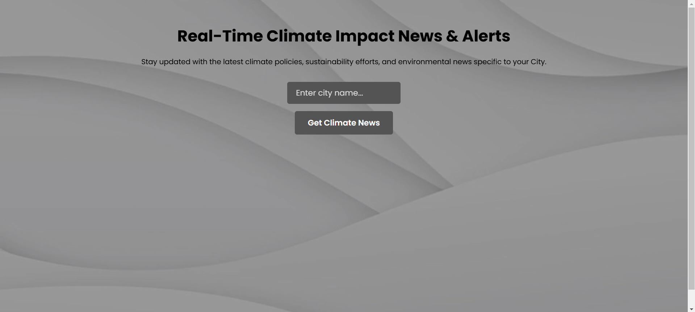
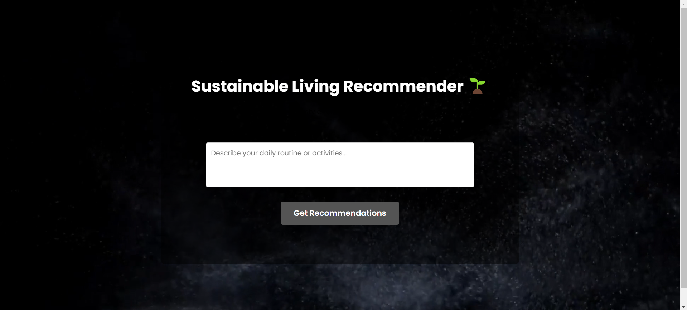
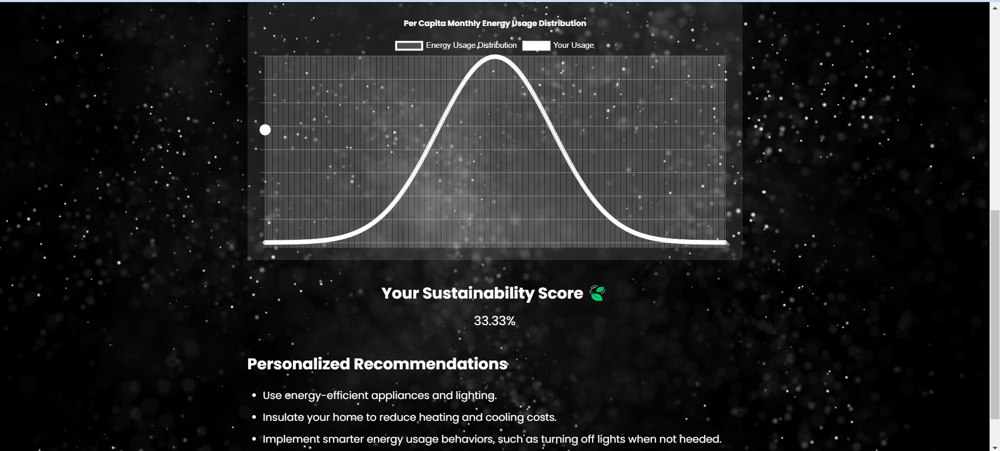
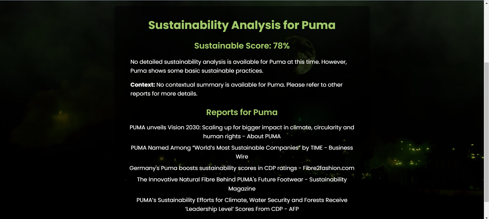
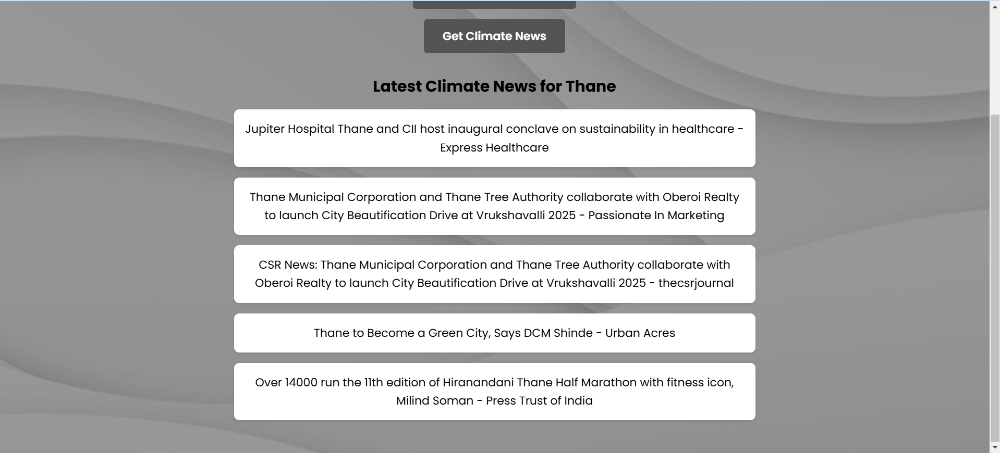
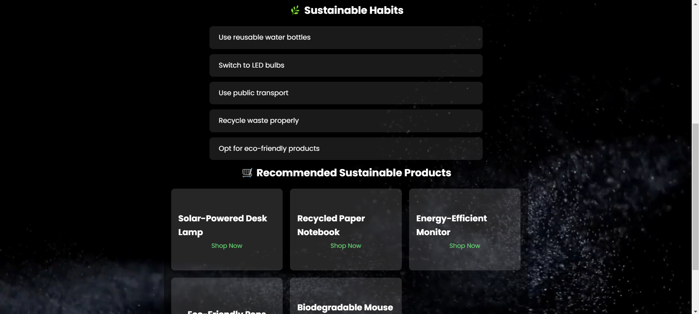

# EcoMark 🌍♻️

[](https://github.com/hardik0903)  
[](https://www.linkedin.com/in/hardik-pandey-4a836628a/)  
[](mailto:hardikpandey0903@gmail.com)

> **EcoMark** is an innovative sustainability platform that empowers you to **analyze**, **discover**, and **recommend** sustainable practices and products for a greener future! 🌱✨

---

## Table of Contents 📑
- [Overview](#overview-)
- [UI & Design](#ui--design-)
- [Features](#features-)
  - [Energy Analyzer ⚡](#energy-analyzer-)
  - [Sustainable Brands 🌿](#sustainable-brands-)
  - [Sustainable News 📰](#sustainable-news-)
  - [Sustainable Recommender 🛍️](#sustainable-recommender-)
- [Data & Workflows](#data--workflows-)
- [Setup & Running the Project 🚀](#setup--running-the-project-)
- [Contact & Social Links](#contact--social-links-)
- [License](#license-)

---

## Overview 📝



**EcoMark** leverages modern web technologies and AI-powered APIs to provide users with:
- Detailed analysis of their energy consumption 📊
- Sustainability analysis for brands 🔍
- Curated sustainability news 🗞️
- Personalized sustainable lifestyle recommendations and eco-friendly product suggestions 💡🛒

The project integrates several tools:
- **Energy Analyzer:** Computes per capita energy consumption and sustainability scores.
- **Sustainable Brands:** Analyzes brand sustainability using AI and provides a sustainability score along with contextual reports.
- **Sustainable News:** Aggregates news reports on sustainability for a selected brand.
- **Sustainable Recommender:** Suggests sustainable habits and eco-friendly products (with recommendations linked to Amazon.in) based on your daily routine.

Under the hood, the project uses:
- A **facts.js** file containing rotating sustainable facts.
- An **activity_product_mapping.json** (referred to as `activityjson` in the docs) that maps daily activities to eco-friendly product suggestions.
- Various API endpoints (Flask-based) that power the analysis using tools such as **Google Generative AI**, **OpenAI**, and **Gemini API**.

---

## UI & Design 🎨

The UI is modern, minimal, and eco-inspired. Here’s an overview of the design:







---

## Features ✨

### Energy Analyzer ⚡
- **What It Does:**  
  - Computes per capita energy consumption.
  - Calculates a sustainability score based on energy usage bounds.
  - Displays a bell curve graph of energy usage distribution.
- **How It Works:**  
  - User inputs monthly consumption and household size.
  - The system calculates per capita consumption and sustainability score.
  - Recommendations are provided based on the score (e.g., energy-saving tips).
  


### Sustainable Brands 🌿
- **What It Does:**  
  - Analyzes sustainability performance of a brand.
  - Provides a detailed AI-powered sustainability analysis, contextual summary, and a sustainability score.
  - Displays related sustainability reports/news.
- **How It Works:**  
  - User enters a brand name.
  - The backend calls a Gemini API to generate analysis and score.
  - Data is then displayed in card-like format with elegant typography.
  


### Sustainable News 📰
- **What It Does:**  
  - Aggregates sustainability news and reports from Google News RSS feeds.
- **How It Works:**  
  - User inputs a brand name.
  - The system fetches the latest news articles related to the brand’s sustainability.
  - Articles are displayed with clickable links for more details.
  


### Sustainable Recommender 🛍️
- **What It Does:**  
  - Provides personalized sustainable lifestyle recommendations.
  - Suggests eco-friendly habits and products.
  - Product recommendations link to **amazon.in** for easy shopping.
- **How It Works:**  
  - User describes their daily routine.
  - AI analyzes the routine and suggests 5 sustainable habits.
  - Based on matched activities (from `activity_product_mapping.json`), eco-friendly product recommendations are generated.
  - Each recommended product links to an Amazon.in search page for that product.
  


---

## Data & Workflows 🔄

- **facts.js:**  
  - Contains an array of interesting sustainability facts that rotate on the landing page.
- **activity_product_mapping.json (activityjson):**  
  - Maps user activities (e.g., “exercise”, “cooking”) to eco-friendly product suggestions.
- **APIs:**  
  - Flask-based backend providing endpoints for energy analysis, brand analysis, news aggregation, and sustainable recommendations.
  - Uses AI models (Gemini, OpenAI) to generate detailed reports and scores.

---

## Setup & Running the Project 🚀

### Prerequisites:
- **Node.js** (recommended LTS version) and **npm**
- **Python 3** and required libraries (Flask, Flask-CORS, google-generativeai, feedparser, python-dotenv, openai, nltk, scipy)
- Install NLTK VADER lexicon:
  ```bash
  python -c "import nltk; nltk.download('vader_lexicon')"
